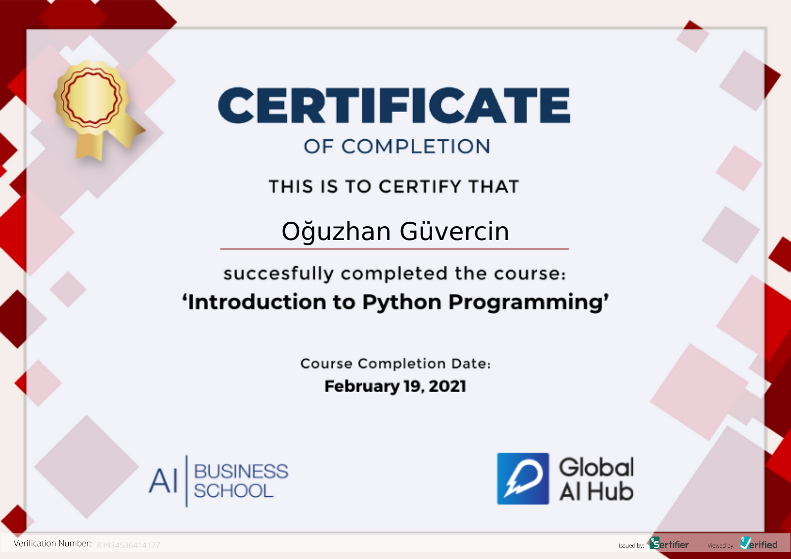

# GAIH Student Repo


**Course Date:** 15.02.2021 - 19.02.2021  
**Name:** Oğuzhan  
**Surname:** GÜVERCİN  
**Email:** ogzhngvrcn00@gmail.com  

Format of my homeworks is ".py". This scripts were written via PyCharm and Python version 3.8 .

## Recipe Maker
A python script that cooks three different dishes and showing every step of the dish to user.
Recipes are Karnıyarık, rice and french fries. Basically my 3 favorite dishes.

## Requirements
```
In some of homeworks i used Python's built-in "random" module and
"os" for clearing terminal in hangman script 
In my final project i imported "time" again a built-in Python module
```
---

### Certification


[Verifying Link](https://verified.cv/en/verify/83934536414177)
